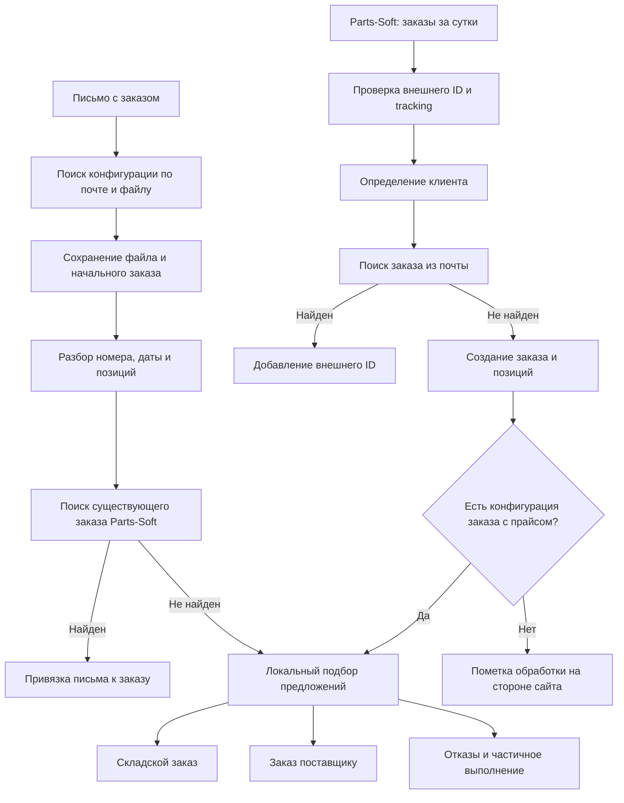

# Аудит заказов, прайсов и интеграций DragonZap

Дата: 20.09.2026. Проверены исходники backend `f3d9281` и frontend `272ee0a`, включая локальное изменение кнопок заказов. Это аудит кода, а не проверка рабочей базы: настройки сервера, реальные остатки, доставки писем и документы 1С не проверялись. Внешние заказы и рассылки не запускались.

## Главный вывод

Основные механизмы уже есть: загрузка писем, импорт Parts-Soft, подбор предложений, складские и поставщицкие заказы, контроль прайсов, очереди доставки и журнал обмена с 1С. Главный пробел — согласованность между этими механизмами. Один заказ имеет несколько источников, но идентичность, владелец обработки и состояние исполнения пока определяются разными правилами.

Приоритет: сначала исключить повторную закупку и ошибочное объединение заказов, затем сделать явными состояния обработки и исправить обмен изменениями. Простое ускорение расписаний или увеличение параллельности сейчас увеличит риск гонок.

## Реализовано по результатам аудита

Первый критический этап уже внесён в код после первоначального анализа:

- почта и Parts-Soft используют один алгоритм идентификации заказа с проверкой даты, бренда, артикула, количества и суммы; неоднозначный результат не объединяется автоматически;
- сопоставление заказов одного клиента сериализовано блокировкой PostgreSQL, а локальная обработка заказа захватывает его строку и сохраняет закупку с метаданными Parts-Soft одной транзакцией;
- сохраняются `processing_owner`, `processing_state` и основание совпадения; оптовый маршрут выбирается только при одной однозначной активной конфигурации, остальные случаи помечаются для проверки;
- полное совпадение tracking ID подавляет собственный заказ сайта, частичное или конфликтующее совпадение остаётся в сверке; одинаковый файл на другой день больше не скрывает новый заказ без устойчивого номера;
- очередь изменений товаров получила монотонную версию: изменение во время отправки остаётся `pending`; при восстановлении удалённой карточки повторно передаются все локальные фото;
- повторное проведение документа после отмены создаёт новую ревизию события 1С;
- email relay продлевает аренду перед SMTP, а подтвердить результат может только захвативший письмо worker; повтор подтверждения `sent` идемпотентен;
- неудачная плановая генерация/отправка клиентского прайса повторяется после настраиваемой паузы, а ручной и плановый запуск одной конфигурации защищены общим замком в БД;
- изменение уже импортированного документа Parts-Soft не перезаписывает локальный финансовый или складской документ, а получает статус `changed_after_import` для сверки;
- в таблице заказов действия собраны в компактный ряд иконок, а проблемный маршрут заказа показан отдельной меткой.

Открыты последующие этапы: сохраняемая очередь отдельных заданий клиентских прайсов, собственное хранение импортированных фото, синхронизация изменений исполнения заказов и документов, а также рабочий адаптер под конкретную конфигурацию 1С.

## 1. Как загружаются и обрабатываются заказы

### Почта

- Конфигурация задаёт отправителя, почтовый аккаунт, шаблоны темы/вложения и разбор колонок. Письма без подходящей конфигурации не становятся обычными заказами автоматически.
- Файл и начальная запись сохраняются до обработки; предусмотрено восстановление прерванного импорта и повтор ошибок.
- Повторы проверяются по состоянию обработки почты и хешу файла; отдельно выполняется поиск заказа Parts-Soft.
- При найденном заказе Parts-Soft письмо и файл прикрепляются к нему, временный заказ удаляется. Эта ветка заканчивается без обычного цикла обработки письма.
- Для нового заказа используются клиентский прайс, предложения, соответствия брендов/артикулов и правила цены/количества. Формируются складские задания, поставщицкие позиции и отказы. Отправка поставщику — отдельный этап расписания; создание позиции ещё не означает отправку.

Источники: `services/customer_orders.py:1321,1647,2918,2964,4806,4926,5174`; `services/scheduler.py:1474,1928` (здесь и далее пути относительно `dz_fastapi/`, если не указано иначе).

### Parts-Soft

- Автоматическая загрузка ограничена последними 24 часами по **дате создания** заказа. В этой загрузке нет фильтра только по Москве или только по ИНН: передаётся `region_id=None`.
- По умолчанию проверка запускается каждые 10 минут, если включена. Реальные интервалы зависят от окружения сервера.
- Снимки для сверки хранятся 7 дней; при первом запуске запрашивается и недельный архив. Это отдельный механизм от суточного импорта.
- Существующий внешний ID пропускается. Совпавший tracking собственной отправки предотвращает импорт закупки как клиентского заказа.
- Клиент ищется по внешней связи, реквизитам, а для части розничных случаев — по контактам. Имя само по себе не служит идентификатором.
- Присутствие конфигурации заказов с клиентским прайсом переводит заказ в местную обработку. Иначе код помечает позиции как обработанные сайтом.

Источники: `services/partssoft_order_reconciliation.py:415,660,1425,1700`; `services/scheduler.py:154,626`; `services/customer_orders.py:3723`.

## 2. Подтверждённые проблемы заказов

### A1. Алгоритм дублей допускает и пропуски, и ложные совпадения — критический приоритет

Проверены три воспроизводимых примера на функции `_find_matching_local_order`, без базы:

| Сценарий | Фактический результат |
|---|---|
| Один клиент, одинаковые позиции/цены/дата, номера `A123` и `B456` | Совпадение не найдено: разные непустые номера блокируют следующие проверки |
| Одинаковый номер `123`, но другой год и другая сумма | Заказы признаются совпавшими по номеру |
| Номера отсутствуют, одинаковые артикул/количество/время, но разные бренды и цены | Заказы признаются совпавшими по упрощённому составу |

Текущая схема не соответствует правилу «номер не подошёл → проверить клиента, сумму и позиции». В обеих ветках импорта есть ранний выход по одинаковому номеру и пропуск при разных номерах. Упрощённый состав содержит артикул и количество, без бренда; разные суммы допускаются в пределах 15 минут. При равных суммах окно расширяется до 120 минут.

**Исправление:** единый сервис сопоставления для почты, автоматического импорта и окна сверки. Приоритет — сохранённый внешний ID/tracking; затем номер с проверкой клиента, периода и непротиворечивости состава; затем нормализованный состав с брендом, количеством и суммой. Разные номера должны допускать поиск кандидата, но не безусловное слияние. Несколько кандидатов, конфликт бренда или состава → ручная проверка без закупки. Сохранять основание решения и исходные данные обоих источников.

Источники: `services/partssoft_order_reconciliation.py:220,258`; `services/customer_orders.py:1647`.

### A2. Защита от параллельного создания/обработки неполная — критический приоритет

Уникальность внешнего ID защищает от двух одинаковых импортов Parts-Soft, но не от одновременного импорта письма и сайта. Оба процесса могут проверить отсутствие совпадения до сохранения второго заказа. Проверка `NEW` и проверка отсутствия поставщицких связей также не захватывают заказ на обработку атомарно.

`max_instances=1` действует внутри отдельного задания одного scheduler. Почта зарегистрирована несколькими заданиями; ручной запуск и другой процесс этим ограничением не защищены. `tracked_execution` ведёт журнал, но не блокирует второй запуск.

**Исправление:** сохранять входящие события отдельно с уникальными ключами источника, сериализовать сопоставление одного клиента и атомарно захватывать заказ на обработку. Состояния `processing`, время аренды и версия должны переживать перезапуск. Побочные эффекты закупки создавать через очередь с устойчивым ключом. Один хеш содержимого нельзя делать универсальным уникальным ключом заказа: клиент вправе повторить ту же покупку.

Источники: `services/customer_orders.py:3723,3855`; `services/scheduler.py:741,753,766`; `services/monitoring.py:285`; модель `CustomerOrder` в `models/partner.py`.

### A3. «Обработан сайтом» сейчас означает решение программы, а не подтверждение Parts-Soft

Розничная ветка присваивает всем позициям `SUPPLIER`, `ship_qty=requested_qty`, нулевой отказ и `partssoft_processed`, а заказу — `PROCESSED`. Фактическое подтверждение поставщика, отказ, отгрузка или отмена на сайте в этой операции не проверяются. Такая запись может создавать видимость полного исполнения.

При этом «оптовый маршрут» выбирается наличием конфигурации с прайсом, а не проверенным типом клиента. Берётся последняя конфигурация по ID. Неподтверждённая связь с клиентом не является здесь стоп-условием. Оптовик без конфигурации может попасть в ветку сайта.

**Исправление:** разделить `источник заказа`, `кто закупает`, `состояние импорта`, `состояние исполнения`. Ввести явную настройку маршрута клиента: наша система / Parts-Soft / проверить. Для локальной обработки требовать однозначного клиента и выбранную конфигурацию. Статусы сайта хранить отдельно от локального расчёта.

Источники: `services/customer_orders.py:3723,3937`; `crud/customer_order.py:83`; `api/customer_order.py:218`.

### A4. Автозаказ API-источников не согласован с текущим порядком обработки

`sync_partssoft_orders` сначала запускает `_auto_process_partssoft_orders`, затем `_auto_order_api_items`. Последний принимает только `api_ready`, но успешная обработка до этого заменяет статус на `partssoft_processed` или `local_workflow`. Таким образом, штатно успешно обработанная строка до отправки этим механизмом уже не доходит. Наличие отдельного теста функции отправки не доказывает работу всей цепочки.

**Исправление:** сначала утвердить владельца закупки. Заказ, уже закупаемый сайтом, повторно не отправлять. Для локальной закупки API-позиций выделить отдельное состояние исполнения и очередь, сохранять внешний результат и проверять неопределённый исход после тайм-аута. Нельзя просто переставить вызовы местами: это способно создать повторную закупку.

Источники: `services/partssoft_order_reconciliation.py:1583,1858`; `services/customer_orders.py:3845,3985`.

### A5. Импорт уже существующего заказа не обновляет его исполнение

Внешний ID, уже присутствующий в базе, сразу пропускается. Снимок сверки обновляется, но цены, позиции и статусы основного заказа этим проходом не обновляются. Заказы старше суток вообще не входят в запрос по `created_at`, даже если изменились сегодня.

**Исправление:** оставить согласованную глубину создания новых заказов 1 день; отдельно сверять изменения и незавершённые связанные заказы по ID или времени обновления. При простое дольше суток явно показывать разрыв покрытия. Догрузка более старого периода — отдельное управляемое действие, не скрытое расширение окна.

Источники: `services/partssoft_order_reconciliation.py:415,1729`.

### A6. Потеря метаданных между этапами и неполный цикл после связывания письма

Обработка оптового заказа Parts-Soft удаляет исходные строки и создаёт новые. `_process_manual_rows` выполняет commit, затем другая операция переносит внешние идентификаторы и выполняет второй commit. Сбой между ними оставляет локальную обработку выполненной без всех метаданных источника.

Если письмо пришло после Parts-Soft, оно привязывается и импорт заканчивается через `continue`; обычная обработка/формирование ответа письмом в этой ветке не вызываются. Если сайт ранее выбрал неверный маршрут, само поступление письма его не исправляет.

**Исправление:** одна транзакция для строк, метаданных и локальных заданий; уведомления/отправки после фиксации через очередь. Присоединение нового источника должно запускать недостающие этапы, сохраняя уже выполненные закупки.

Источники: `services/customer_orders.py:3186,3787,4926`.

### A7. Дополнительные сценарии, требующие защиты

- Совпадение tracking хотя бы одной строки пропускает весь внешний заказ. Для смешанного заказа нужно разбирать происхождение построчно, как минимум выводить конфликт.
- Один и тот же файл по хешу и клиенту считается повтором без ограничения датой: это может скрыть новый повторный заказ клиента.
- Удаление заказа сейчас мягкое: скрывает его, но не отменяет закупки и отправки. В интерфейсе нужны разные операции «Убрать из списка» и «Отменить исполнение» с проверкой связей.
- Принудительная локальная обработка проверяет местные складские/поставщицкие связи, но не подтверждает отсутствие закупки на сайте. Нужен проверяемый перевод ответственности, а не только кнопка подтверждения.
- Клиенты с ИНН без КПП, в том числе ИП, не получают полноценного точного сопоставления по нынешней ветке `ИНН+КПП`. Контакты для розницы также не всегда уникальны. Конфликты должны иметь отдельную очередь, а не только счётчик в логе.

Источники: `services/partssoft_order_reconciliation.py:1290,1430,1734`; `services/customer_orders.py:3855,3922,4806`.

## 3. Прайсы поставщиков и клиентские рассылки

```mermaid
flowchart LR
  File[Письмо / файл поставщика] --> Parse[Разбор и очистка]
  Parse --> Filters[Фильтры позиций и брендов]
  Filters --> Guard[Сравнение с опубликованным прайсом]
  Guard -->|Аномалия| Review[Проверка администратором]
  Review --> Queue[Очередь утверждённых файлов]
  Queue --> Publish[Публикация прайса]
  Guard -->|Допустимо| Publish
  Publish --> Sources[Выбор источников клиентского прайса]
  Sources --> Fresh[Проверка актуальности]
  Fresh --> Build[Фильтры, наценки, аналоги, итоговый файл]
  Build --> Quality[Контроль качества / черновик]
  Quality --> Delivery[Публикация и доставка]
  Delivery --> Relay[SMTP через relay]
  Delivery --> Direct[Прямая отправка выбранным транспортом]
```

### Что уже сделано полезного

- Парсинг больших файлов вынесен в `to_thread`; есть контроль памяти и журналы загрузки.
- На импорт одной конфигурации поставщика берётся advisory transaction lock. Утверждённые файлы берутся из очереди через `FOR UPDATE SKIP LOCKED`.
- Аномалии проверяются по числу строк, пересечению ассортимента и изменениям цен. База сравнения выбирается по последнему опубликованному ID, включая ручную загрузку, а не только по последнему автоматическому файлу.
- Для источников клиентского прайса учитывается участие после фильтров. При включённом `block_stale_sources` неактуальный источник исключается из выдачи; остальные могут отправляться. Имя настройки историческое: фактическое поведение — исключение источника.
- Возраст считается в рабочих днях; есть временное продление. Это не то же самое, что строго 24 часа, и это нужно одинаково объяснять в интерфейсе.
- Формируется сохранённый файл и сводка генерации; есть контроль качества, режим черновика, правила публикации, наценки и фильтры.
- SMTP через relay использует очередь отдельно по получателям, захват с арендой и повторы. Статус прайса сводится по всем письмам. Старые ещё не отправленные версии могут отменяться при замене.
- В текущем backend есть `published_at`: клиентский прайс может стать доступным для обработки заказов без почтовых получателей. Сгенерирован, опубликован, поставлен в очередь и отправлен — разные события.

Источники: `services/process.py:2258,2875,3247,3407,4160`; `services/pricelist_guard.py:368,489`; `services/pricelist_review_queue.py:122`; `services/email_outbox.py:201,286,423`.

### Что доработать

1. **Устойчивые задания вместо длинного цикла всех конфигураций.** Рассылка проходит конфигурации последовательно. Один тяжёлый файл задерживает следующие, повтор расписания может пропускаться из-за занятого задания. Нужны отдельные сохраняемые задания по конфигурации и времени, ограниченное число исполнителей, приоритеты и возраст ожидания. Не запускать все тяжёлые импорты одновременно.
2. **Общая блокировка генерации.** Плановый и ручной запуск должны использовать один уникальный ключ генерации/публикации, чтобы не создавать две версии и две рассылки одного периода. Ограничения одного scheduler для этого недостаточно.
3. **Проверка lease relay.** Захватывается пачка писем, аренда по умолчанию 300 секунд. При долгой обработке пачки другой relay может повторно взять ещё выполняемую запись. Нужны продление аренды, идентификатор захвата и проверка его при подтверждении. `mark-sent` сейчас принимает только ID; повтор увеличивает attempts и меняет время отправки.
4. **Неопределённая доставка.** SMTP мог принять письмо, а подтверждение в backend потеряться. Нельзя обещать «ровно одна доставка» средствами SMTP. Нужны стабильный Message-ID, местный журнал отправок relay, повтор подтверждения и отдельное состояние «результат неизвестен». `sent` не доказывает попадание во входящие получателя; для Resend полезны статусы доставки/возвратов от провайдера.
5. **Контроль пропущенной рассылки.** Нужны сроки: файл получен → опубликован → клиентский файл построен → взят relay → подтверждён. Ошибка отправки, попытка и доставка не должны считаться одинаково выполненным расписанием. Текущий отбор учитывает `last_attempt_at` и записи `send_failed`, поэтому повтор генерации того же периода может не произойти автоматически.
6. **Единая версия цен.** В заказе сохранять, по какой опубликованной версии клиент заказывал и по какому предложению закупили. Уже есть опубликованные ассоциации/аналоги; стоит довести объяснение выбора поставщика до каждой строки.
7. **Скачок итогового ассортимента.** Исключение старого источника может убрать большую долю клиентского прайса. В сводке показывать исключённые источники, потерянные позиции и влияние на ассортимент; при опасном изменении использовать существующий контроль качества, а не незаметно отправлять резко урезанный файл.

Источники: `services/scheduler.py:2059,2208`; `services/email_outbox.py:286,332,373`; `services/customer_orders.py:1321,2918`.

## 4. Parts-Soft: готовность обмена

| Объект | Что реализовано | Ограничение |
|---|---|---|
| Клиенты | Внешние связи, дополнение пустых полей, legal_name, классификация и источник регистрации, объединение | Неоднозначные реквизиты/контакты и отсутствие КПП требуют отдельной политики |
| Поставщики | Импорт, внешние ID, дополнение реквизитов | Полнота зависит от фактического ответа API; не все поля обязаны быть заполнены у источника |
| Заказы | Суточный импорт, недельная сверка, tracking, попытки сопоставления с почтой | Ошибки A1–A7; нет полной синхронизации исполнения существующих заказов |
| Товары | Импорт по внешнему ID / бренд+артикул, описание, размеры, вес, ссылки на фото | Входящий обмен дополняет, а не перезаписывает заполненные поля |
| Изменения товаров наружу | Очередь, повтор ошибок, создание/обновление/удаление, восстановление удалённой на сайте карточки | Передаётся ограниченный набор полей; конкурентное изменение и фото требуют доработки |
| Документы клиентов | Снимки накладных → `PaymentInvoice` с позициями | Это финансовый объект, не складская отгрузка и не подтверждённый документ ЭДО |
| Документы поставщиков | Снимки → `SupplierReceipt` с позициями, ГТД, страной, кодами маркировки | Импорт не вызывает проведение; нужно сопоставление, проверка и приёмка |
| ЭДО | В импортируемых данных могут быть идентификаторы/реквизиты | Получение подписанных файлов, подписей и статусов оператора этим кодом не реализовано |

### Товары: важные ограничения

- **Фото сохраняются ссылкой.** Импорт создаёт `Photo(url=...)`, а не скачивает файл в наше хранилище. Удаление записи на сайте не удалит нашу строку, но удаление самого файла сделает её неработающей. Нужны сохранённые у нас оригиналы, контрольная сумма, источник, порядок и права на публикацию.
- Исходящий обмен передаёт название, артикул, бренд, описание, размеры/вес и новые локальные фото. Наличие поля в карточке или срабатывание триггера ещё не означает передачу поля: например, триггер реагирует на ЧЗ/применимость/сертификаты, но `_local_product_form` этих полей не отправляет.
- Удаление/замена локальной фотографии не реализовано как явная операция удаления конкретного изображения на стороне Parts-Soft. Сейчас наружу в основном добавляются ещё не загруженные локальные URL.
- **Риск потерять изменение в очереди:** триггер снова ставит строку `pending`, пока исполнитель отправляет предыдущую версию, а исполнитель затем без проверки версии записывает `sent`. Нужны монотонная версия изменения и подтверждение именно захваченной версии.
- При восстановлении удалённой карточки `_outbound_photo_urls` может заставить пропустить ранее загруженные фото, хотя у новой карточки их нет. Нужен сброс состояния фото при смене внешнего ID и сверка удалённого набора.
- Исходящий `POST` после потерянного ответа может создать повторную карточку. Требуется проверка результата по устойчивой идентичности перед повторным созданием, если API не предоставляет идемпотентность.
- Полная сверка не должна принимать неполную/аномально пустую выгрузку за массовое удаление: перед восстановлением множества карточек нужен контроль полноты ответа.

Источники: `services/partssoft_order_reconciliation.py:782`; `services/partssoft_exchange.py:85,124,199`; `alembic/versions/d6f9a2c4e7b1_add_partssoft_outbox_and_documents.py:103`.

### Документы: важные ограничения

Снимок уже импортированного документа обновляется, а связанный локальный документ пропускается. Изменение суммы, оплаты, состава или отмены на сайте не переносится этим проходом в созданный `PaymentInvoice`/`SupplierReceipt`.

Импорт клиентского документа считает его полностью оплаченным по наличию `payment_at`. Это не самостоятельная сверка оплат и не учёт частичной оплаты. Сопоставление документов, уже пришедших через почту/другой канал, по бизнес-идентичности в этих функциях отсутствует: внешний ID защищает лишь повтор одного документа Parts-Soft.

По расписанию первый проход документов смотрит 30 дней, последующие — 2 дня. Поэтому окно заказов 1 день не распространяется на документы. После длительного простоя потребуется контролируемая догрузка.

Нужно разделить оригинал документа, бухгалтерский/финансовый объект и складское движение, добавить версии, отмены и связь с уже существующими документами. Проводить импортированное поступление только после проверки, чтобы не удвоить склад.

Источники: `services/partssoft_exchange.py:374,432,491`; `services/scheduler.py:566`.

## 5. Обмен с 1С: что готово на самом деле

Есть три разных направления, их нельзя считать одной законченной интеграцией:

1. **Экспорт и протокол обмена с сайтом:** HTTP-обработчики, выгрузки XLSX/XML, статусы и служебные операции.
2. **Новая очередь документов:** снимки отгрузок, поступлений, складских документов и производственных волн; события проведения/отмены для поддержанных операций; пакеты, устойчивые ключи, подтверждения по событиям, журнал и повторы. Это хорошая основа надёжного транспорта.
3. **Адаптеры конкретной 1С:** УТ 11 — исходная заготовка обработки; функции создания/отмены документов явно выбрасывают исключение «Нужно настроить ... под релиз тестовой УТ 11». УНФ EnterpriseData — согласование формата и узлов; сообщение с данными оставляется без подтверждения, потому что разбор тела не реализован.

Следовательно, нельзя обещать, что после настройки логина и расписания вся первичка автоматически появится в 1С. Нужен работающий адаптер под фактическую конфигурацию и релиз.

### Что добавить

- Выбрать целевой контур: какая конкретно УНФ/УТ является рабочей, какие документы и в каком направлении она принимает. Развести владельцев склада, оплат, номеров и ЭДО.
- Реализовать документы и справочники на стороне 1С; хранить устойчивые связи организаций, контрагентов, договоров, номенклатуры, единиц, складов и ставок НДС.
- Проверить покрытие **всех** движений: поступления, реализации, возвраты, перемещения, списания, инвентаризация, производство. Наличие четырёх типов событий ещё не доказывает такое покрытие.
- Ввести версию бизнес-перехода. Сейчас ключ `entity_type:entity_id:event_type` навсегда один на `posted`. Для поступления возможны проведение → распроведение → повторное проведение, а повторный `posted` вернёт старое событие. Нужны новые события ревизий при сохранении идемпотентности повторной доставки одной ревизии.
- Зафиксировать порядок событий одного документа, результаты частичных ошибок, ручной повтор и наблюдение за неподтверждённым пакетом. Сейчас активный пакет повторяется до подтверждения; зависший получатель требует заметного предупреждения.
- Провести пилот на копии 1С: создание, повтор пакета без дубля, потеря подтверждения, отмена, повторное проведение, ошибка одного события из нескольких, сверка сумм и остатков.

Источники: `api/one_c.py`; `services/one_c_outbox.py:317,466,574`; `services/one_c_enterprise_data.py:424`; `services/supplier_workflow.py:926,1080`; `docs/integrations/1c_ut11/src/DragonZapExchange.bsl:174`; `docs/integrations/1c_unf3/README.md`.

## 6. Производительность и наблюдаемость

- Сопоставление загружает всех клиентов или всю историю заказов клиента в Python. По мере роста базы это увеличит задержки. Нужны индексируемые нормализованные реквизиты, внешние связи, ограничение кандидатов периодом и пакетные запросы.
- Разбор таблиц, сетевые запросы и длительные операции сейчас связаны с большими сервисными функциями. Разделить этапы: принять → распознать → проверить → опубликовать/обработать → доставить. Между этапами хранить результат и ошибку.
- На дашборде показывать не только количество, но и возраст очереди: старейший необработанный заказ, неподтверждённый источник, прайс на проверке, письмо pending, зависший пакет 1С, ошибку обмена товара.
- Для каждого заказа нужна хронология: получен откуда, к чему привязан и почему, кто выбрал маршрут, по какой версии прайса подобран поставщик, что реально отправлено и подтверждено.
- Для сводок полезны независимые ошибки виджетов, последнее успешное обновление и ссылка на проблемные записи. HTTP 200 у `/claim` и успешный `/health` не означают работу всей цепочки.
- В сборке frontend основной JS-файл около 3,12 MB до gzip (около 881 kB gzip). Есть предупреждение Vite о размере. Следующий шаг интерфейса — разбиение страниц и тяжёлых редакторов на ленивые модули, после измерения времени загрузки.

## 7. Предлагаемый порядок работ

| Этап | Изменение | Условие готовности |
|---|---|---|
| 1 | Единое сопоставление и атомарная обработка заказов | Почта→сайт, сайт→почта и одновременное поступление дают один заказ и одну закупку; неоднозначность не скрывается |
| 2 | Явный маршрут опт/розница, статусы исполнения и очередь API | Оптовик проходит местный цикл; сайт-управляемый заказ не закупается повторно; сбой/повтор не теряют состояние |
| 3 | Обновление существующих заказов и документов | Изменения/отмены видны; догрузка после простоя управляемая; импорт не удваивает склад/финансы |
| 4 | Устойчивая очередь генерации и доставки прайсов | Один тяжёлый файл не блокирует всех; видны просроченные задания и реальные результаты по получателям |
| 5 | Версии товарного обмена и собственное хранение фото | Изменение во время отправки не теряется; удаление фото на сайте не лишает нас изображения |
| 6 | Пилот адаптера 1С и ревизии документов | Полный цикл тестового документа, включая отмену/повтор, проходит со сверкой итогов |
| 7 | Дашборд контроля и дальнейшее упрощение интерфейса | Из предупреждения можно перейти к причине и следующему действию |

## 8. Изменения интерфейса в рамках этого аудита

В «Заказах клиентов» и «Ошибках импорта» действия заменены иконками в одну строку: просмотр, редактирование, удаление, местная обработка и повтор (последние две — по доступности). Есть всплывающие подсказки и `aria-label`. Подтверждение удаления и принудительной обработки сохранено. Общий рендер исключает расхождение двух таблиц; ширина учитывает до пяти кнопок.

Изменены `dz_frontend/src/components/CustomerOrdersPage.jsx` и `dz_frontend/src/index.css`. Правила закупки и слияния заказов этим UI-изменением не менялись.

## 9. Что проверено и что ещё проверить

Выполнено:

- ESLint изменённого компонента — без ошибок.
- Production build frontend — успешен; остаётся предупреждение размера JS.
- 19 выбранных тестов: EnterpriseData, контракт клиента 1С, несколько проверок аномалий прайса и сопоставления Parts-Soft — прошли. Запуск без общих DB fixtures, с предварительной инициализацией моделей; это не интеграционная проверка базы.
- Три диагностических примера A1 воспроизвели текущие ошибки сопоставления.
- Статический разбор маршрутов, транзакций, очередей и контрактов. Конкурентные риски A2 и товарной очереди выведены из кода; нагрузочный эксперимент не проводился.

Для проверки на рабочей системе нужен отдельный read-only срез: версии контейнеров и миграций, настройки включения обменов, последние запуски заданий, пары заказов с позициями и внешними связями, возраст emailoutbox, статусы пакетов 1С и снимков документов. Секреты и полный дамп базы для этого не нужны. Сначала отчёт расхождений; массовое объединение и повторные отправки — только по проверенному плану.

Обязательные будущие интеграционные сценарии: разные номера одного заказа; повтор номера в другом периоде; одинаковый артикул разных брендов; намеренно повторная одинаковая покупка; частичный состав и отмена; разные КПП и ИП без КПП; смешанные tracking; два параллельных импорта; сбой после закупки до фиксации результата; письмо после импортированного сайта; изменение товара во время отправки; потеря SMTP/HTTP-подтверждения; проведение→отмена→повторное проведение в 1С.
