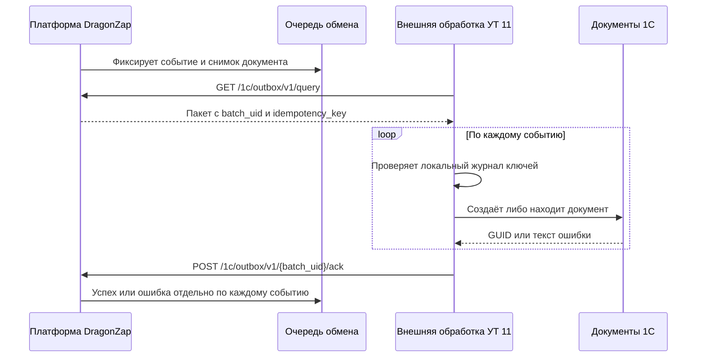

# Интеграция DragonZap с 1С:УТ 11

## Граница этапа

Платформа уже формирует неизменяемые события и не считает документ переданным,
пока 1С не вернула результат. Этот каталог фиксирует транспортный контракт и
даёт исходную заготовку внешней обработки для первого пилота.

Файл `.epf` не хранится в Git: его собирают в Конфигураторе той версии
платформы 1С, на которой работает тестовая база. Исходный модуль находится в
[`src/DragonZapExchange.bsl`](src/DragonZapExchange.bsl).

## Поток обмена

## Соответствие документов

| Событие платформы | Плановый объект УТ 11 | Комментарий |
|---|---|---|
| `shipment / posted` | Реализация товаров и услуг | Физическая номенклатура списывается со склада, клиентские бренд и артикул сохраняются в назначенных дополнительных реквизитах/печатной форме |
| `supplier_receipt / posted` | Приобретение товаров и услуг | Поставщик, склад, ГТД, страна и КИЗ берутся из снимка поступления |
| `stock_document / posted` | Оприходование, списание или пересортица | Вид документа выбирается по `payload.document_type` |
| `production_wave / completed` | Сборка (разборка) товаров | Материалы DragonZap списываются, готовая продукция приходуется одной производственной волной |
| любой тип / `cancelled` | Отмена проведения связанного документа | Документ ищется по журналу `idempotency_key`, новый не создаётся |

Названия документов и реквизитов нужно подтвердить на тестовой копии: они
зависят от точного релиза УТ 11 и установленных расширений.

## Защита от дублей

1. У каждого события есть уникальный `event_uid` и детерминированный
   `idempotency_key`.
2. При сетевой ошибке платформа повторно отдаёт тот же `batch_uid` и те же
   снимки данных.
3. Обработка сначала ищет ключ в локальном журнале 1С. Если документ уже создан,
   она не создаёт второй, а возвращает прежний GUID.
4. Платформа помечает только успешно подтверждённые события. Ошибочные остаются
   видны администратору и могут быть возвращены в очередь.

Для пилотной `.epf` журнал можно хранить в `ХранилищеОбщихНастроек`. Для
рабочего расширения `.cfe` нужен непериодический регистр сведений с уникальным
измерением `КлючИдемпотентности` и ресурсами `ТипСобытия`, `UIDСобытия`,
`СсылкаДокумента`, `ДатаОбработки`, `Статус`, `ТекстОшибки`.

## Порядок пилота

1. Задать на сервере `ONE_C_EXCHANGE_LOGIN` и
   `ONE_C_EXCHANGE_PASSWORD`, пересоздать `dz_fastapi`.
2. Проверить `/1c/outbox/v1/ping` клиентом из
   `scripts/one_c_ut_adapter/client.py`.
3. Передать 1С-разработчику этот каталог и копию тестовой УТ.
4. Собрать внешнюю обработку `.epf`, заполнить адрес и учётные данные.
5. Реализовать и проверить обработчики сначала для одного тестового поступления
   и одной реализации.
6. Проверить повторную отправку того же пакета и отсутствие дублей.
7. После пилота перенести код в `.cfe`, добавить регистр журнала и регламентное
   задание.

## Безопасный запуск

`ping` не изменяет очередь. `query` переводит события в состояние передачи,
поэтому ручной `pull` следует использовать осознанно: пакет будет повторяться,
пока 1С не подтвердит его или администратор не вернёт события в очередь.

